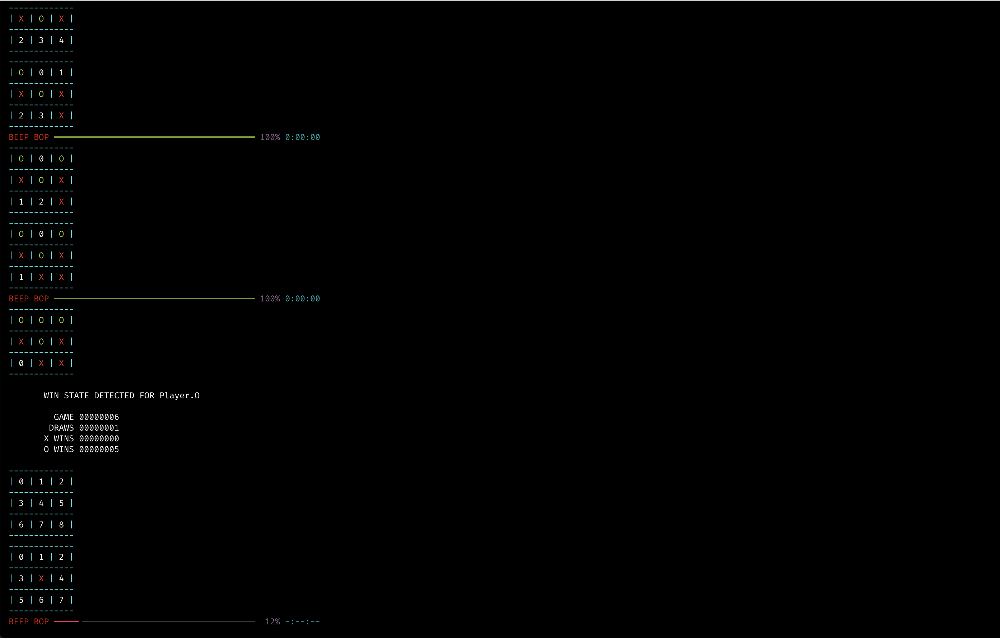

# Minimax Tic-Tac-Toe kata

Basic Minimax implementation applied to Tic-Tac-Toe. The code as-is will play 10 autonomous games of the minimax algorithm against an opponent who makes random moves.

On line 243, you can see how to swap the randomized AI for a human player.



## Running

You need Python 3. 

```bash
git clone https://github.com/spacekitcat/minimax-tic-tac-toe-python.git
cd minimax-tic-tac-toe-python
pip3 install -r requirements.txt
python3 main.py
```


## License

MIT - Honestly, I don't care. This is a throwaway.
